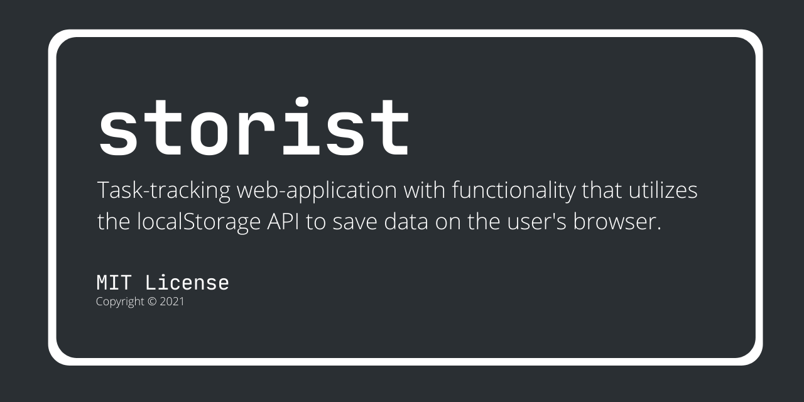

`storist` is a task-tracking web-application with featurestrongly inspired by [Todoist](https://todoist.com/app/), but with functionality that utilizes the [`localStorage` API](https://developer.mozilla.org/en-US/docs/Web/API/Window/localStorage)  to save data on the user's browser as opposed to doing so on a server. It's tech-stack includes HTML, CSS, and JavaScript as well as the usage of [Bootstrap](https://getbootstrap.com/) for styling purposes and [Webpack](https://webpack.js.org/) for module bundling.

## Installation

[A live demo of the web-application on GitHub Pages is available.](https://francislangit.github.io/storist/) Otherwise, for those that would like to run the project on their local machines, follow these steps:

1. Clone the repository with `https://github.com/FrancisLangit/storist/` or download it as a `.zip` file.
2. Navigate to where the repository is saved on your local machine.
3. Use [`npm install`](https://docs.npmjs.com/cli/v7/commands/npm-install) to install the application's dependencies.
4. Open up `dist/index.html` on your preferred web browser to view and use the project.

## Usage

### Creating A Project

Projects are where users can organize tasks for under a specific category. Use the "Add Project" button in the "Projects" button dropdown to open up a modal where a new project can be created.

### Adding Tasks

Use the "+ Add Task" button to open up a modal where a task can be created.

### Editing A Task

Click on a task to access a modal where it can be edited.

### Deleting A Task

Click on a task to access its "Delete Task" button. Such will open up a modal where the user is prompted to delete the task.

### Deleting A Project

Click on a project's "Delete Project" button. Such will open up a modal where the user is prompted to delete the project.

### Contributing

Pull requests are welcome for those that would like to make a contribution in the form of fixing a bug or adding a feature. For those that would like to apply major changes to the repository, we'd like to request that you open up an issue first and discuss the changes you'd like to make.

### License

[MIT License](https://github.com/FrancisLangit/storist/blob/main/LICENSE)